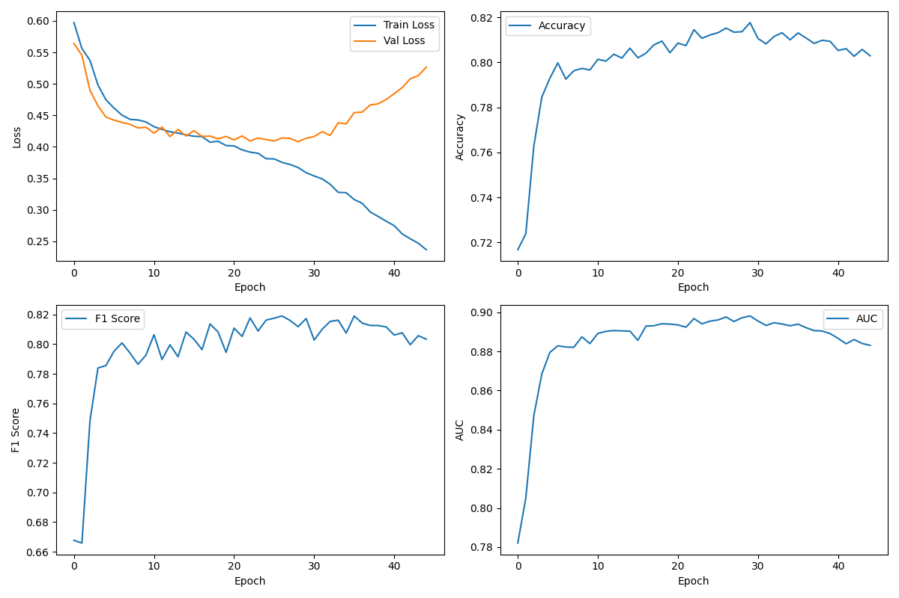

# NOTE!!! THIS PROJECT IS PART OF THE AUTHOR'S SUBMISSION FOR PEKING UNIVERSITY'S 2025 IGEM ENTRANCE EXAM
# PromoterGRU

A deep learning project using a GRU (Gated Recurrent Unit) model to predict whether a 70nt DNA sequence is a promoter.

## Project Structure

- `model.py`: GRU model definition and architecture
- `data_processing.py`: Data loading and preprocessing functions
- `train.py`: Model training and evaluation script
- `best_model.pth`: Trained model weights

## Model Architecture

This project implements a bidirectional GRU (Gated Recurrent Unit) model for processing DNA sequence data. The model architecture includes:

1. **Embedding Layer**: Transforms one-hot encoded DNA sequences into high-dimensional feature representations
2. **Bidirectional GRU Layers**: Captures long-range dependencies and contextual information in the sequence
3. **Attention Mechanism**: Helps the model focus on the most important parts of the sequence
4. **Classification Head**: Multi-layer fully-connected network for the final binary classification

### Architecture Details

- **Input**: One-hot encoded DNA sequence (shape: [batch_size, 70, 4])
- **Embedding**: Linear transformation followed by GELU activation and LayerNorm
- **GRU**: 3-layer bidirectional GRU with 256 hidden units
- **Attention**: Custom sequence attention mechanism
- **Classification Head**: 3-layer network with decreasing hidden sizes

## Data Processing

The data processing pipeline includes:

1. Loading the DNA promoter dataset
2. Converting DNA sequences to one-hot encodings
3. Data augmentation (adding reverse complement sequences)
4. Handling class imbalance through weighted sampling

## Training Process

### Hyperparameters

- Batch size: 128
- Learning rate: 1e-4
- Weight decay: 0.01
- Early stopping patience: 15
- Gradient clipping: 1.0
- Training epochs: Up to 200 (with early stopping)

### Optimization

- **Optimizer**: AdamW
- **Learning rate scheduler**: OneCycleLR
- **Loss function**: BCEWithLogitsLoss
- **Mixed precision training**: Enabled using PyTorch's automatic mixed precision (AMP)

### Training Metrics

The model's performance is evaluated using the following metrics:

| Metric | Description |
|--------|-------------|
| Loss | Binary cross-entropy loss |
| Accuracy | Proportion of correct predictions |
| Precision | Positive predictive value (TP / (TP + FP)) |
| Recall | Sensitivity or true positive rate (TP / (TP + FN)) |
| F1 Score | Harmonic mean of precision and recall |
| AUC | Area under the ROC curve |

## Performance

The model achieves the following performance on the test set (approximate values, will vary with training runs):

- **Accuracy**: ~0.82
- **Precision**: ~0.82
- **Recall**: ~0.81
- **F1 Score**: ~0.81
- **AUC**: ~0.90

The training history is visualized and saved as `training_history.png`, showing the progression of:
- Training and validation loss
- Validation accuracy
- Validation F1 score
- Validation AUC



## Usage

### Training the Model

```bash
python train.py
```

Training automatically saves the best model to `best_model.pth` based on validation AUC, and generates a training history plot.

### Model Implementation

The GRU implementation offers several advantages for this task:

1. **Efficiency**: GRU models are more computationally efficient than Transformer models
2. **Sequential Understanding**: GRUs naturally handle sequence position information without requiring positional encodings
3. **Performance**: For medium-sized datasets, GRUs often perform comparably to Transformers
